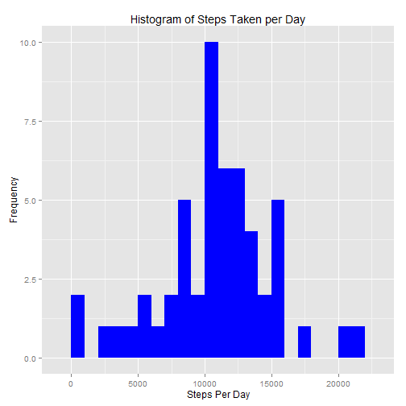
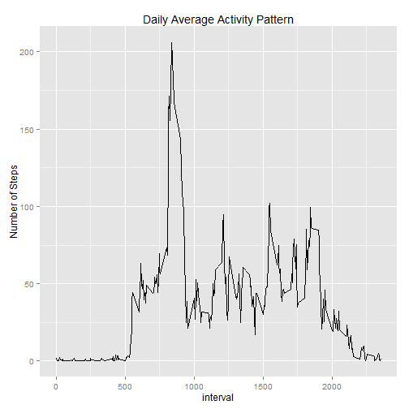
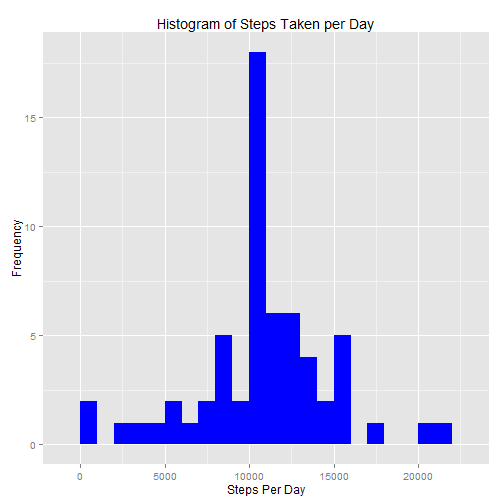
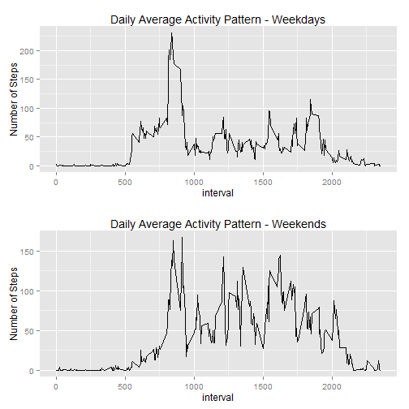

## Loading libraries

```r
library(knitr)
library(dplyr)
library(ggplot2)
library(gridExtra)
```

## Loading and Preprocessing the data

```r
#Read in data
data <- read.csv("activity.csv")
#Data with NA's removed
data2 <- data[complete.cases(data),]
```

## Mean total number of steps taken per day

```r
totalSteps <- data2 %>%
        group_by(date) %>%
        summarise(steps = sum(steps))

ggplot(totalSteps, aes(x=steps))+geom_histogram(fill="blue", binwidth=1000)+labs(title="Histogram of Steps Taken per Day", x="Steps Per Day",y="Frequency")
```

 

```r
mean <- mean(totalSteps$steps)
median <- median(totalSteps$steps)
```
Mean Number of Steps per Day: 10,766.19  
Median Number of Steps per Day: 10,765


## Average Daily Activity Pattern

```r
dailyAvg <- aggregate(data2$steps, by=list(interval=data2$interval), FUN=mean)
colnames(dailyAvg) <- c("interval","steps")

ggplot(dailyAvg, aes(x=interval, y=steps))+geom_line()+labs(title="Daily Average Activity Pattern", xlab="Interval", y="Number of Steps")
```

 

```r
maxAvg <- dailyAvg[which.max(dailyAvg$steps),]
```

The 5 minute interval that contains the maximum number of steps is interval 835 with 206.1698 steps

## Imputing Missing Values

```r
missingValues <- nrow(data)-nrow(data2)
        
rows <- dailyAvg$interval
rownames(dailyAvg) <- rows
        
imputeData <- mutate(data, steps=ifelse(is.na(steps),dailyAvg[as.character(interval),2],steps))
checkNA <- sum(is.na(imputeData$steps))

#mean number of days and histogram
df <- imputeData %>%
        group_by(date) %>%
        summarise(steps = sum(steps))

ggplot(df, aes(x=steps))+geom_histogram(fill="blue", binwidth=1000)+labs(title="Histogram of Steps Taken per Day", x="Steps Per Day",y="Frequency")
```

 

```r
mean2 <- mean(df$steps)
median2 <- median(df$steps)
```
There are 2,304 missing values

After replacing the missing values, the new mean and median are:  
Mean Number of Steps per Day: 10,766.19  
Median Number of Steps per Day: 10,766.19

## Differences in Activity Patterns between Weekdays and Weekends

```r
weekend <- c("Saturday","Sunday")
typeDays <- mutate(imputeData, day=ifelse(weekdays(as.Date(imputeData$date)) %in% weekend,"weekend","weekday"))

weekdays <- filter(typeDays, day=="weekday")
weekdayAvg <- aggregate(weekdays$steps, by=list(interval=weekdays$interval), FUN=mean)
colnames(weekdayAvg) <- c("interval","steps")
plot1 <- ggplot(weekdayAvg, aes(x=interval, y=steps))+geom_line()+labs(title="Daily Average Activity Pattern - Weekdays", xlab="Interval", y="Number of Steps")

weekends <- filter(typeDays, day=="weekend")
weekendAvg <- aggregate(weekends$steps, by=list(interval=weekends$interval), FUN=mean)
colnames(weekendAvg) <- c("interval","steps")
plot2 <- ggplot(weekendAvg, aes(x=interval, y=steps))+geom_line()+labs(title="Daily Average Activity Pattern - Weekends", xlab="Interval", y="Number of Steps")

grid.arrange(plot1,plot2, ncol=1)
```

 
